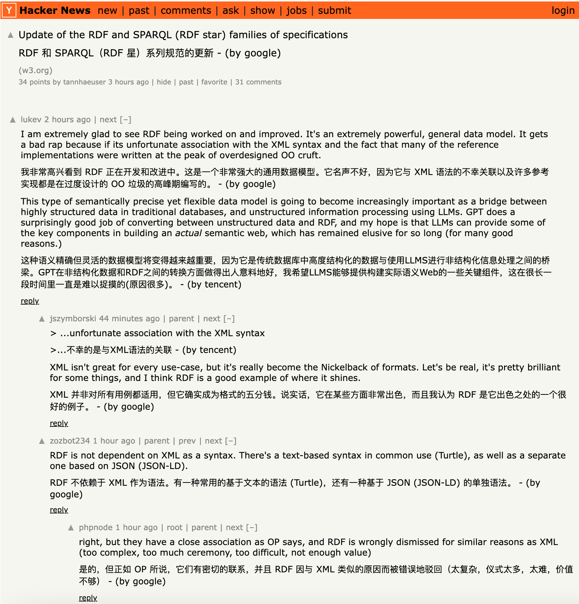

# transcat

transcat是一个翻译服务管理工具，主要任务是协调和管理多个不同的翻译服务(如Google，彩云小译，腾讯翻译君等)。特色功能是**负载均衡**，可以自由组合不同的翻译服务来实现负载均衡。

transcat提供了兼容沉浸式翻译(Immersive translate)的API，具体配置请参考: [沉浸式翻译API](#与沉浸式翻译集成)



## 支持的服务

| 服务名称   | 支持情况 | 需要申请API Key | 限流建议(cap/window) | 申请指南                                                     |
| ---------- | -------- | --------------- | -------------------- | ------------------------------------------------------------ |
| Google     | 是       | 否              | 10/1                 |                                                              |
| 微软翻译   | 是       | 否              | 5/1                  |                                                              |
| DeepLX     | 是       | 否              | 1/1                  |                                                              |
| 腾讯翻译君 | 是       | 是              | 5/1                  | [点击进入](https://bobtranslate.com/service/translate/tencent.html) |
| 百度翻译   | 是       | 是              | 10/1(高级认证)       | [点击进入](https://bobtranslate.com/service/translate/baidu.html) |
| 彩云小译   | 是       | 是              | 10/1                 | [点击进入](https://bobtranslate.com/service/translate/caiyun.html) |
| 阿里翻译   | Working  | 是              |                      | [点击进入](https://bobtranslate.com/service/translate/ali.html) |
| OpenAI     | 是       | 是              | 1/1                  | [点击进入](https://bobtranslate.com/service/translate/openai.html) |

**注:** 强烈【不推荐】在沉浸式翻译下使用DeepLX，很容易触发429限流导致一段时间无法使用DeepLX。如果要使用OpenAI，推荐使用多几个Key做负载均衡。

## 配置

启动服务需要加载一个配置文件，格式如下：

```json
{
  "server_address": "127.0.0.1",
  "app_key": "app_key",
  "server_port": "8086",
  "datasource": {
    "type": "sqlite"
  },
  "services": [
    {
      "name": "google_translate1",
      "type": "google",
      "proxy": "http://127.0.0.1:7890",
      "weight": 3,
      "limit": 500000
    },
    {
      "name": "tencent",
      "type": "tencent",
      "app_key": "app_key",
      "app_id": "app_id",
      "region": "region",
      "weight": 2,
      "limit": 500000,
      "ratelimit": {
        "type": "token-bucket",
        "capacity": 5,
        "time_window": 1
      }
    },
    {
      "name": "caiyun1",
      "type": "caiyun",
      "app_key": "app_key",
      "weight": 2,
      "limit": 1000000,
      "ratelimit": {
        "type": "token-bucket",
        "capacity": 10,
        "time_window": 1
      }
    },
  ],
  "mode": "select",
  "load-balance-rule": "weight"
}
```

### 参数说明

* `server_address`  - 服务器监听地址，默认为127.0.0.1

* `server_port ` - 监听端口，默认8010

* `app_key` - 认证的Key

* `assets_dir`: 资源文件输出目录，比如log、sqlite3的数据库文件等，docker环境下此参数会被忽略。

* `mode`  工作模式
  * **select** - 手动选择翻译服务(services)中的一个
  * **load-balance** - 程序自动负载均衡选择翻译服务，支持3种负载均衡策略

* `load-balance-rule`: 只有mode为load-balance这个配置才会被加载，可选项: 
  * **weight** - 根据service中配置的权重负载均衡，比如a、b，c的weight分别为1,2,3; 如果有7个请求，分别会命中1，2，3个请求命中a、b，c。
  * **round-robin** - 轮询选择
  * **usage** - 根据当前剩余用量选择，用量计算公式为: usage = limit - currentUsage。每次调用某个翻译服务，它的usage都会增加。比如翻译`HelloWorld`命中了`caiyun`，那么它的usage会增加10(字符长度)。
* services - 翻译服务数组
  * `name` - 名字可以随意起，不过必须唯一，否则启动会报错
  * `type` - 翻译服务类型，目前支持下面服务
    * googlex - Google翻译，直接调用它网页的API，不需要填写密钥。
    * bingx - 微软的翻译，直接调用它网页的API，不需要填写密钥。
    * baidu - 百度翻译，需要填写密钥。如果要用，建议高级认证，因为普通用户1秒限流1个请求。
    * tencent - 腾讯翻译君，需要填写申请到的密钥。
    * caiyun - 彩云小译，需要填写申请到的密钥。
    * openai - 目前支持`gpt-3.5-turbo`和`gpt4`
    * deeplx - 推荐只在standalone模式下使用
  * `app_key` - 你翻译服务的app_key(或者叫token)，根据你翻译服务来填写
  * `app_id` - 翻译服务app_id，目前baidu和tencent都有这个参数
  * `mode` - 一个数组，标识引擎工作在什么样的mode下，可多选。
    * 留空(默认) - 支持任何工作模式
    * select - 该引擎只会在select模式下工作
    * load-balance - 该引擎只会在load-balance模式下工作
    * standalone - select和load-balance都不可用，但可以在单独调用时指定调用该引擎翻译
  * `weight` - 负载均衡权重，只有mode是load-balance会起作用。
  * `limit` - 每月的token数,当mode是load-balance，且rule为usage，这个值的大小会影响优先级
  * `proxy` - http代理，如果设置了，翻译服务会使用代理访问互联网。比如: http://127.0.0.1:7890
  * `ratelimit` - 配置限流，比如capacity=10, time_window=1，那么1秒内，最多只能接受10个请求
    * type - 目前仅支持`token-bucket`
    * capacity - token数量
    * time_window - 时间窗口


## 启动服务

### 从源码启动

```shell
python flight.py --config config.json
```

### 安装到本地

请先从release中下载最新版本到本地，执行下面命令

```shell
# 把{version}替换为你下载的版本
python -m pip install transcat-{version}.tar.gz
# 安装完后，通过下面命令启动服务
transcat --config config.json
```

上面两种方式，本地必须先安装python，推荐使用最新版。请把上面命令中的python替换为你实际本地的python版本，最低支持到3.7.0。

### 从Docker启动

**获取镜像**

你可以通过Docker Hub和源代码构建的方式获得镜像

* 从Docker Hub获取

  transcat的镜像支持x86-64以及ARM-64架构，所以Apple Silicon的用户可以放心从Docker hub中下载镜像。

  transcat的docker地址是: [点击进入](https://hub.docker.com/r/bigbyto/transcat)，使用下面命令从docker hub中下载镜像。

  ```shell
  docker pull bigbyto/transcat:${version}
  ```

  具体支持的version请进入docker hub中查看。

* 从源码中构建镜像

  ```shell
  # Clone最新的代码
  git clone https://github.com/xingty/transcat
  
  # 进入transcat
  cd transcat
  
  # 构建镜像,${version}替换为具体的版本，可参考setup.py中的version
  docker build -t bigbyto/transcat:${version}
  ```

  

**从镜像构建并启动容器**

```shell
docker run --name transcat \
-e TRANSCAT_PORT=8020 \
-dp 8020:8020 \
--mount "type=bind,src=/var/data/transcat/,target=/var/data/transcat/" \
bigbyto/transcat:${version}
```

上面的参数分别含义如下:

* `--name` -  容器的名称，可以随意指定
* `-e TRANSCAT_PORT=8020` - 容器内服务监听的端口，该参数优先级高于`config.json`中的`server_port`。
* `-dp` - 后台启动容器，且映射本机的8020到容器的8020。请注意容器的端口必须和`TRANSCAT_PORT`一致。
* `--mount` - src是本地存放配置文件的目录，**config.json放在这个目录下,请【不要】改target**。

**启动容器**

当容器存在且处于停止状态，可通过下面命令重新启动容器

```shell
docker container start transcat
```

上面命令中的"transcat"为创建容器时的名称。

**配置代理**

请注意，使用容器的方式启动，意味着本机和容器的网络环境互相隔离，如果你的代理位于本机，必须要打通本机和容器的网络环境才能生效。

如果要在容器中使用transcat且需要配置HTTP代理，推荐把代理也容器化并置于同一个网络环境中，这样可以省去不少的麻烦。


## 与沉浸式翻译集成

目前沉浸式翻译没有直接支持transcat，不过因为它支持DeeplX，transcat对它DeeplX的接口做了兼容，使用步骤如下:

1. 点击扩展的"选项"进入扩展主页

2. 点击主页下方的"开发者设置"，开启 Beta 测试特性

3. 基本设置中找到 DeepLX，输入自建 transcat的URL，如: http://127.0.0.1:8010/api/translate/deeplx/adapter?show_engine=1&disable_cache=0&app_key=key

   `app_key`是必填项，该参数的值是config文件中的app_key。

   `show_engine` 参数为1时，翻译文字后面会带上翻译服务类型。比如

   ```shell
   #请求翻译原文: hello,world!
   #show_engine = 1: 你好，世界 - (by google)
   #show_engine = 0: 你好，世界
   ```

   `disable_cache` 默认为0。transcat会缓存翻译结果，如果下次翻译命中缓存，默认会直接从缓存中取出。如果`disable_cache` = 1，那么将忽略缓存直接调用翻译服务查询新的结果。**注意: 沉浸式翻译本身就会缓存翻译结果，因此如果你的参数有变动，请换一个网页查看效果。**


## Bob插件

[点击进入](https://github.com/xingty/bob-plugin-transcat)安装transcat的bob插件


## REST-API

transcat提供了一些REST-API，可以通过API更改mode等，目前支持的API如下:

### 沉浸式翻译API

* POST: `/translate/deeplx/adapter`

* Content-Type: `application/json`

* Authorization: `Bareer  app_key`

* query params

  * app_key - 配置文件中的app_key，该选项必填
  * show_engine - 0: 不显示翻译引擎 1-显示翻译引擎，默认为0
  * disable_cache - 是否禁止cache 0: 不禁止 1-禁止，默认为1

* body

  ```json
  {
    "text": "hello world",
    "source_lang": "en",
    "target_lang": "zh"
  }

* Response

  ```json
  {
    "code": 200,
    "id": 123321,
    "data": "你好 世界",
    "alternatives": []
  }
  ```

### 切换Mode

运行时改变mode，如把select改为load-balance

* PUT: `/translate/mode/switch`

* Content-Type: `application/x-www-form-urlencoded`

* Params
  * mode - `[select | load-balance]`
  * rule - `[weight | round-robin | usage]`，当mode为load-balance时，rule必填


### 切换翻译服务

当mode为select时，可以通过这条API选择某个翻译服务

* PUT: `/translate/select`
* Content-Type: `application/x-www-form-urlencoded`
* Authorization: `Bareer  app_key`
* Params
  * index - 服务列表中的index


### 选择服务翻译

* POST: `/translate/{engine}`

* Content-Type: `application/json`

* Authorization: `Bareer  app_key`

* params:

  * engine - config文件配置的任意一个翻译引擎类型，比如: googlex、deeplx、caiyun等

* body:

  ```json
  {
    "text": "hello world",
    "source_lang": "source language",
    "target_lang": "target language"
  }
  
  ```

* response

  ```json
  {
    "code": 200,
    "data": "你好 世界",
    "engine":
  }
  ```


### 获取服务器状态

获取当前服务器的状态，包括translator、usage、mode等信息

* GET: `/server/status`
* Authorization: `Bareer  app_key`


## TODO

Web-UI


## LICENSE

[LICENSE](https://github.com/xingty/transcat/blob/main/LICENSE.md)
